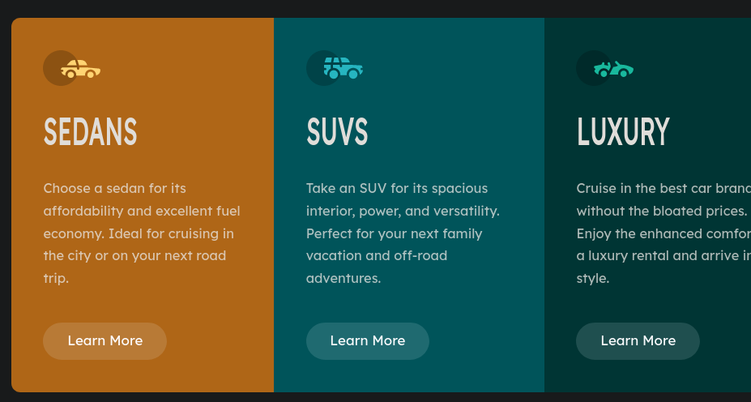

# Frontend Mentor - 3-column preview card component solution

This is a solution to the [3-column preview card component challenge on Frontend Mentor](https://www.frontendmentor.io/challenges/3column-preview-card-component-pH92eAR2-). Frontend Mentor challenges help you improve your coding skills by building realistic projects.

## Table of contents

- [Overview](#overview)
  - [The challenge](#the-challenge)
  - [Screenshot](#screenshot)
  - [Links](#links)
- [My process](#my-process)
  - [Built with](#built-with)
  - [What I learned](#what-i-learned)
  - [Continued development](#continued-development)
  - [Useful resources](#useful-resources)
- [Author](#author)
- [Acknowledgments](#acknowledgments)

**Note: Delete this note and update the table of contents based on what sections you keep.**

## Overview

### The challenge

Users should be able to:

- View the optimal layout depending on their device's screen size
- See hover states for interactive elements

### Screenshot



Add a screenshot of your solution. The easiest way to do this is to use Firefox to view your project, right-click the page and select "Take a Screenshot". You can choose either a full-height screenshot or a cropped one based on how long the page is. If it's very long, it might be best to crop it.

Alternatively, you can use a tool like [FireShot](https://getfireshot.com/) to take the screenshot. FireShot has a free option, so you don't need to purchase it.

Then crop/optimize/edit your image however you like, add it to your project, and update the file path in the image above.

**Note: Delete this note and the paragraphs above when you add your screenshot. If you prefer not to add a screenshot, feel free to remove this entire section.**

### Links

- Solution URL: https://github.com/jwren4170/preview_cards
- Live Site URL: https://preview-cards-seven.vercel.app/

## My process

### Built with

- Semantic HTML5 markup
- CSS custom properties
- Flexbox
- Mobile-first workflow

### What I learned

I learned a little bit about mixed-blend-mode. The css below allowed the text in my buttons
to be transparent so the background of the card could show through.

```css
.card .btn {
  border-radius: 100vw;
  border: none;
  outline: none;
  padding: 0.75rem 1.5rem;
  mix-blend-mode: screen;
  font-family: 'lexenddeca';
  cursor: pointer;
  background: var(--light-gray);
}

.card .btn::before {
  mix-blend-mode: color-dodge;
}
```

### Continued development

I really need to buckle on more of the javascript stuff.

## Author

- Website - JWord - https://preview-cards-seven.vercel.app/
- Frontend Mentor - @jwren4170 - https://www.frontendmentor.io/profile/jwren4170
